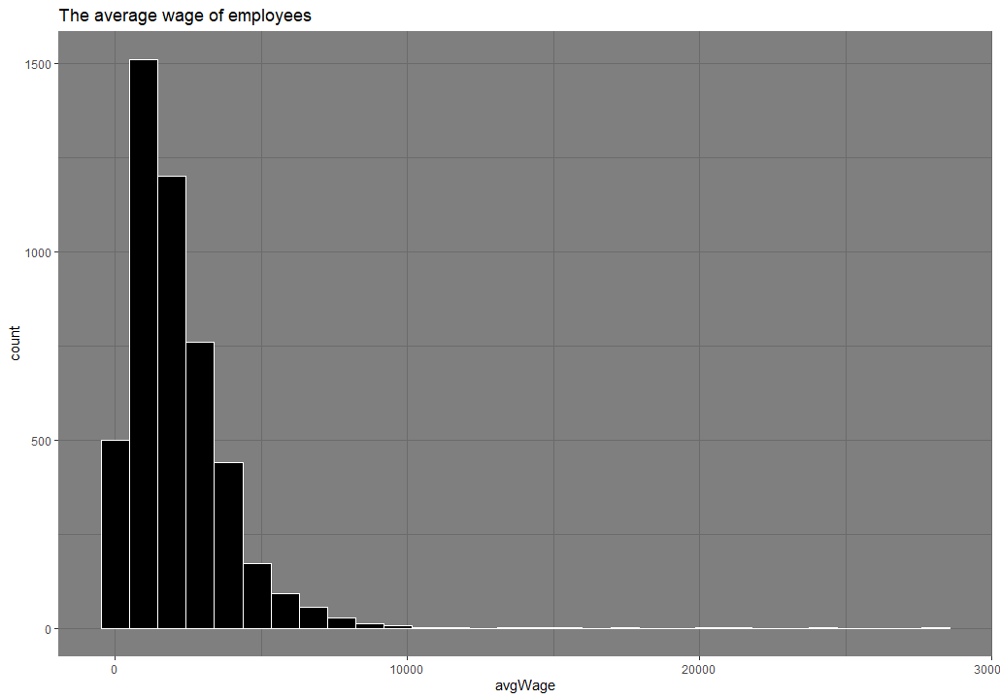
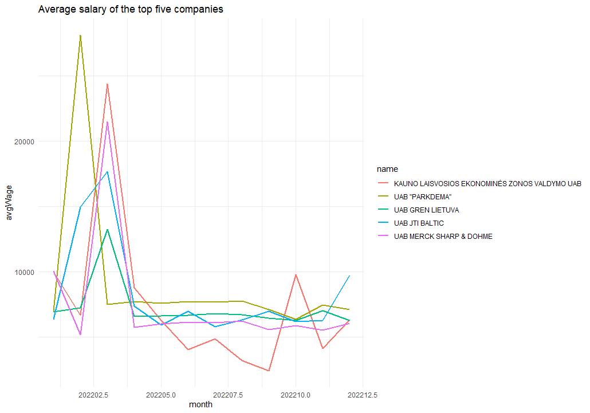
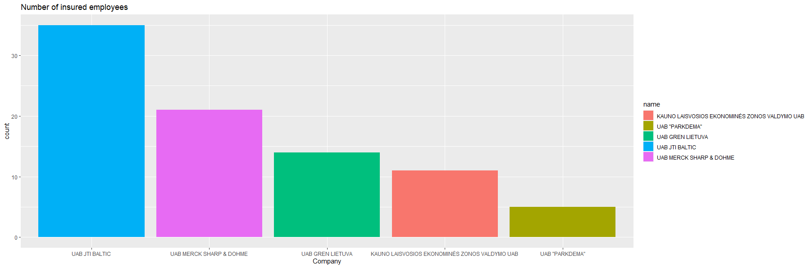

# R Laboratorinis darbas: duomenų vizualizacija

| Variantas | ecoActCode |
|------------- | ------------- |
|  5 | 702200 |

### 1. Užduotis

Atsakymas:

Išvados: Pagal turimus duomenis matome, kad vidutinis atlyginimas sviruoja nuo 0 iki daugiau nei 25000. Didzioji darbuotoju dalis gauna nuo 0 iki 5000. 

### 2. Užduotis

Atsakymas:

Išvados: Nuo 2022.02 iki 2022.12 didžiausią vidutinio atlyginimo šuolį padarė įmonė UAB "Parkdema", kuris buvo pakilęs virš 25 tūkstančių. Visos atvaizduotos įmonės 2022.02 patyrė vidutinio atlyginimo šuolį, tačiau 2022.12 jis grįžo į buvusį 2022.02 arba į dar mažesnį, išskyrus UAB "JTI BALTIC", kurios vidutinis atlyginimas pakilo. 

### 3. Užduotis

Atsakymas:

Išvados: Didžiausią apdraustų darbuotojų kiekį turi įmonmė UAB "JTI BALTIC", mažiausią UAB "PARKDEMA"

### 4. Užduotis

Shiny R aplikacijos nuotrauka:

